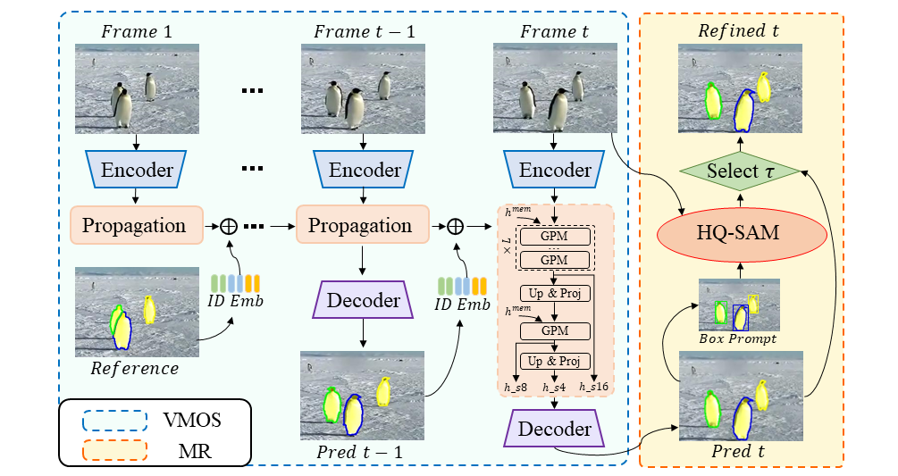

# Tracking Anything in High Quality
**Technical Report**: [](https://arxiv.org/abs/2307.13974)

<table>
<tr>
<td ><center></center></td>
<td ><center></center></td>
<td ><center></center></td>
</tr>
</table>

Tracking Anything in High Quality (HQTrack) is a framework for high performance video object tracking and segmentation.
It mainly consists of a Video Multi-Object Segmenter (VMOS) and a Mask Refiner (MR), can track multiple target objects at the same time and output accurate object masks.

:beer: **HQTrack obtains runner-up in the Visual Object Tracking and Segmentaion (VOTS2023) challenge.**

## :loudspeaker:News
- [2023/7/30] We provide a demo code that can be run locally.
- [2023/7/22] We author a [technical report](https://arxiv.org/abs/2307.13974) for HQTrack.
- [2023/7/3] HQTrack ranks the 2nd place in the VOTS2023 challenge.

## :fire:Demo 
<table>
<tr>
<td ><center></center></td>
<td ><center></center></td>
</tr>
</table>

We also provide a [demo script](demo/demo.py), which supports box and point prompts as inputs. This is a pure python script that allows the user to test arbitrary videos.

## :snake:Pipeline


## :bookmark_tabs:Intallation

* Install the conda environment
```
conda create -n hqtrack python=3.8
conda activate hqtrack
```
* Install Pytorch
```commandline
conda install pytorch==1.9 torchvision cudatoolkit=10.2 -c pytorch
```
* Install HQ-SAM
```commandline
cd segment_anything_hq
pip install -e .
pip install opencv-python pycocotools matplotlib onnxruntime onnx
```
* Install Pytorch-Correlation-extension package
```commandline
cd packages/Pytorch-Correlation-extension/
python setup.py install
```
* Install ops_dcnv3
```commandline
cd HQTrack/networks/encoders/ops_dcnv3
./make.sh
```
* Install vots toolkit
```commandline
pip install vot-toolkit
```
* Install other packages
```commandline
pip install easydict
pip install lmdb
pip install einops
pip install jpeg4py
pip install 'protobuf~=3.19.0'
conda install setuptools==58.0.4
pip install timm
pip install tb-nightly
pip install tensorboardx
pip install scikit-image
pip install rsa
pip install six
pip install pillow
```

## :car:Run HQTrack
* Model Preparation

Download VMOS model from [Google Driver](https://drive.google.com/drive/folders/1Hh10hLtz3YL_zE3PfBCiLB0tvj3Yvv26?usp=sharing) or [Baidu Driver](https://pan.baidu.com/s/120iNn5OEVrqDz0SKjEooig?pwd=vots) and put it under
```
/path/to/HQTrack/result/default_InternT_MSDeAOTL_V2/YTB_DAV_VIP/ckpt/
```
Download [HQ-SAM_h](https://drive.google.com/file/d/1qobFYrI4eyIANfBSmYcGuWRaSIXfMOQ8/view?usp=sharing) and put it under
```
/path/to/HQTrack/segment_anything_hq/pretrained_model/
```


* Initialize the vots workspace
```
cd /path/to/VOTS23_workspace
vot initialize tests/multiobject
```
* Copy our trackers.ini to your vot workspace
```
cp /path/to/our/trackers.ini /path/to/VOTS23_workspace/trackers.ini
```
* Modify your path in trackers.ini
* test the tracker and pack the results
```
bash run.sh
```

## :book: Citation
If you find HQTrack useful for you, please consider citing :mega:
```bibtex
@misc{hqtrack,
      title={Tracking Anything in High Quality}, 
      Author = {Jiawen Zhu and Zhenyu Chen and Zeqi Hao and Shijie Chang and Lu Zhang and Dong Wang and Huchuan Lu and Bin Luo and Jun-Yan He and Jin-Peng Lan and Hanyuan Chen and Chenyang Li},
      Title = {Tracking Anything in High Quality},
      Year = {2023},
      Eprint = {arXiv:2307.13974},
      PrimaryClass={cs.CV}
}
```

## :hearts: Acknowledgment
This project is based on [DeAOT](https://github.com/yoxu515/aot-benchmark), [HQ-SAM](https://github.com/SysCV/SAM-HQ), and [SAM](https://github.com/facebookresearch/segment-anything). 
Thanks for these excellent works.


## :email:Contact
If you have any question, feel free to email jiawen@mail.dlut.edu.cn. ^_^
